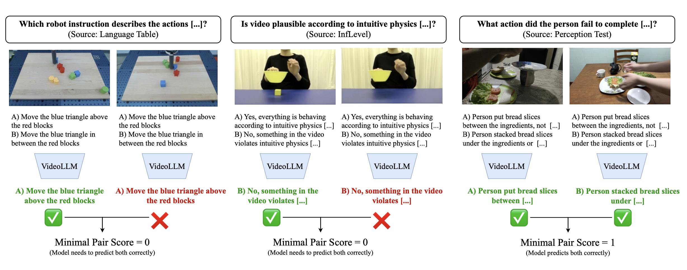

# MVP : Minimal Video Pairs 

A shortcut-aware benchmark for spatio-temporal and intuitive physics video understanding (VideoQA) using minimally different video pairs.

<p align="center">
  
</p>


## Getting started

#### Environment Setup

To enable [reproducible](/reproducibility.md) evaluation, we utilize the [lmms-eval](https://github.com/EvolvingLMMs-Lab/lmms-eval) library, which is referenced as a submodule. First clone this repo using the flag `--recurse-submodules` which will automatically setup the required sumbodules. Alternatively, you will need to manually run `git sumbodule init` after cloning.

Next, navigate into the root directory of the repository and create your conda environment,
```
make .env.init
```

#### Data

The annotations are released at [facebook/minimal_video_pairs](https://huggingface.co/datasets/facebook/minimal_video_pairs) on Huggingface Datasets.
We provide scripts in this repository for downloading the videos in [Makefile](/Makefile), make sure to go and accept all data license requirements for each data source before attempting to download.
Next log into Huggingface (this is needed to download the Vinoground subset)
```
huggingface-cli login
```

Now you can download all videos from their original data sources,
```
make download_videos
```

This will create a `videos` folder with 9 subfolders for different data sources which are used to create the subsets:

| Subset | Data sources |
| --- | --- |
| Human object interactions | [PerceptionTest](https://github.com/google-deepmind/perception_test), [SomethingSomethingV2](https://www.qualcomm.com/developer/software/something-something-v-2-dataset) |
| Robot object interactions | [Language Table](https://github.com/google-research/language-table) |
| Intuitive Physics and collisions | [IntPhys](https://intphys.cognitive-ml.fr/), [InfLevel](https://github.com/allenai/inflevel), [GRASP](https://github.com/i-machine-think/grasp), [CLEVRER](http://clevrer.csail.mit.edu/) |
| Temporal Reasoning | [STAR](https://bobbywu.com/STAR/), [Vinoground](https://vinoground.github.io/) |

## Run evaluation

As previously mentioned, we utilize the [lmms-eval](https://github.com/EvolvingLMMs-Lab/lmms-eval) library to enable [reproducible](/reproducibility.md) evaluation. 
We have provided the task files you need to run `mvp` and `mvp_mini`, `mvp_mini` is essentially a smaller, balanced evaluation set with 9k examples for enabling faster evaluations.

To run the evals: 

- Copy the task files at [tasks/mvp](tasks/mvp) folder files to [lmms-evals/lmms_evals/tasks/](https://github.com/EvolvingLMMs-Lab/lmms-eval/tree/main/lmms_eval/tasks)
- Ensure videos are downloaded in `videos` folder in root of this repository
- Run the evaluations with task names `mvp` and `mvp_mini`. You can also run individual [subsets](tasks/mvp/mvp.yaml). 

We primarily report `paired_accuracy`. An example in `mvp` consists two QA examples, with identical question and answer options (A or B) but the video is differrent and the correct option is different (A is correct for video1 and B for video2). For `paired_accuracy`, a model only gets a correct score (+1) if it gets both questions correct.

## Leaderboard submission

We have setup a leaderboard as part of Physical World Models release from FAIR on Huggingface: [Physical Reasoning Leaderboard](https://huggingface.co/spaces/facebook/pwm_leaderboard). To submit the results of your model on our leaderboard, combine the `mvp_[mini]_{task}.jsonl` in `./logs/{model}` folder and upload with the specifics of your run.

```
cat submissions/mvp_*.jsonl > mvp_submission.jsonl
```

## Citation and acknowledgements
We are grateful to the many open-source datasets on top of which we built our benchmark:
[Perception Test](https://github.com/google-deepmind/perception_test), [Something Something v2](https://www.qualcomm.com/developer/software/something-something-v-2-dataset), [CLEVRER](https://clevrer.csail.mit.edu/), [Language Table](https://github.com/google-research/language-table), [IntPhys](https://intphys.cognitive-ml.fr/), [InfLevel](https://github.com/allenai/inflevel), [GRASP](https://github.com/i-machine-think/grasp), [STAR](https://github.com/csbobby/STAR_Benchmark), [Vinoground](https://vinoground.github.io/).

If you find this repository useful in your research, please consider giving a star ⭐ and a citation, and make sure to cite the original video data sources referenced above as well

```bibtex
@article{krojer2025shortcut,
  title={A Shortcut-aware Video-QA Benchmark for Physical Understanding via Minimal Video Pairs}
  author={Benno Krojer and Mojtaba Komeili and Candace Ross and Quentin Garrido and Koustuv Sinha and Nicolas Ballas and Mahmoud Assran},
  journal={arXiv},
  year={2025}
}
```


## License
We release this benchmark under the [LICENSE](/LICENSE) file in the root directory of this source tree.
